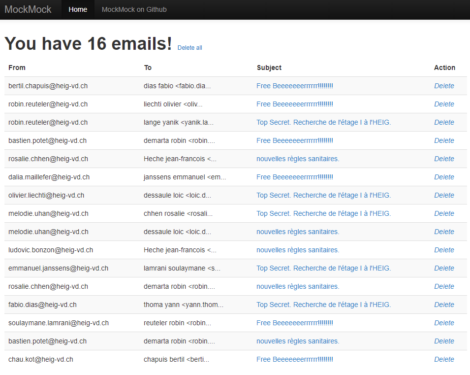
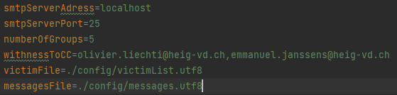
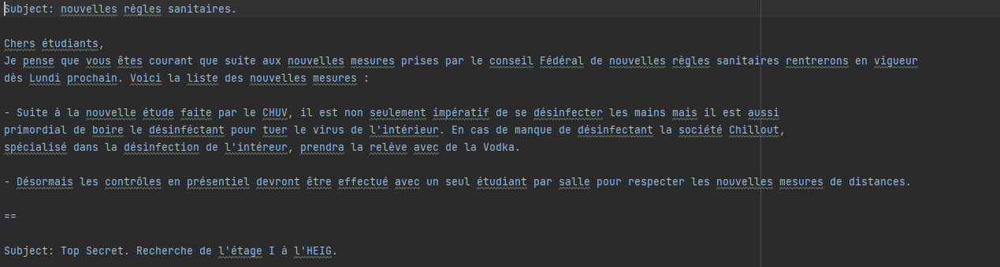
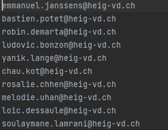
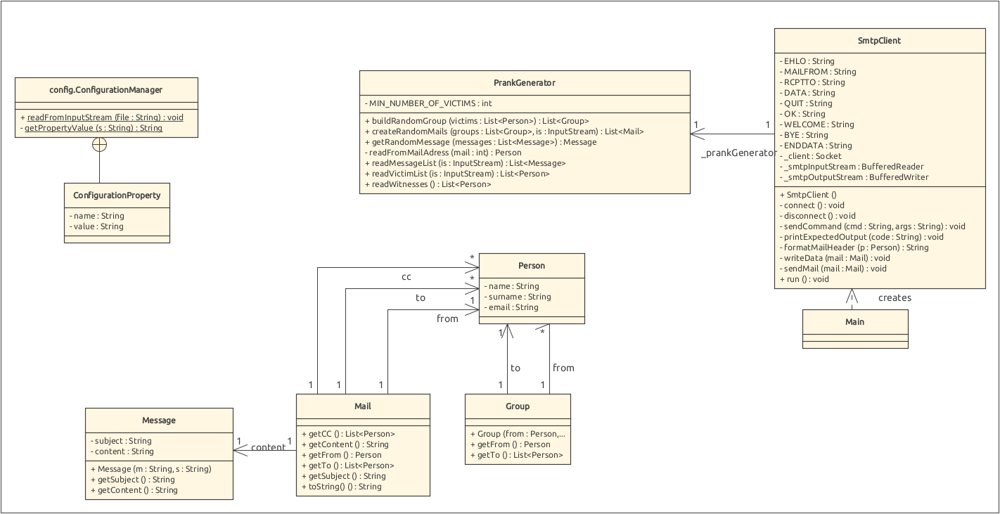

# RES-Labo-04-SMTP

|Auteur|email|
|-----------------|--------------|
| Emmanuel Janssens | emmanuel.janssens@heig-vd.ch|
| Lange Yanik | yanik.lange@heig-vd.ch

## Introduction

L'objectif de ce projet est de se familiariser avec le protocole SMTP et donc faire un programme pouvant envoyer des emails "prank" à un serveur SMTP (Donc faire un client SMTP).
 

### Email "prank" ? Qu'est-ce que c'est ?

L'utilisateur aura une liste de victimes (un fichier victimsList.txt avec une liste de emails) sur lesquelles il veut faire le prank. Il aura également un fichier messages.txt qui contient les messages pour le prank qui seront envoyées.
L'utilisateur choisira ensuite le nombre de groupe de victimes qu'il veut créer (dans chaque groupe il y aura toujours une victime qui envoit le mail et au moins 2 personnes qui vont le recevoir). Les messages du fichier messages.txt seront choisi au hasard pour chaque groupe.

### Je veux faire la blague mais ça m'a l'air compliqué ! Je fais comment ?

Avant de se lancer dedans il faut savoir que ce projet sert à un but purement académique et d'apprentissage. Il est ilégal par la loi d'envoyer des emails forgés ou encore de se faire passer pour quelqu'un d'autres. D'ailleurs vu que la plupart de fournisseurs internet bloquent les envois et que nous ne voulons pas surcharger un vrai serveur SMTP, nous allons utiliser un "Mock Server" SMTP.

### C'est quoi un "Mock Server" ?

Un mock serveur c'est tout simplement une simulation de serveur. On va simuler un serveur SMTP en local sur notre machine auquel on va envoyer nos emails.
Il en existe plusieurs sur internet et github. 

Pour notre projet nous avons décidé d'utiliser le serveur SMTP [MockMock](https://github.com/tweakers/MockMock) qui nous fourni une interface web bien pratique.

Pour lancer le mock server il suffit cloner ce [repository](https://github.com/tweakers/MockMock),
faire la modification [suivante](https://github.com/tweakers/MockMock/pull/8/commits/fa4bea3079d88d7d7b9a28e3b0864ba6f3d9f7ff) dans le pom.xml (GoogleCode ayant fermé).
Une fois cloné et la modification du pom.xml faites, rendez-vous dans le dossier **/release** et localiser le fichier **MockMock.jar**.
Ensuite lancez une console dans ce dossier et executez la commande:
>java -jar mockmock.jar

### J'ai lancé MockMock mais rien ne se passse ?

Dans un navigateur web entrez l'url suivante **localhost:8282** le port http 8282 etant le port par défault utilisé par mockmock (le port SMTP par défault est le 25).

### Ok, j'ai un serveur qui peut recevoir de mails, et le client ?

Pour lancer le client il suffit de cloner ce repository.
Une fois cloné rendez-vous dans le dossier **/release** et localiser le fichier **RES-Labo-04-SMTP-1.0-SNAPSHOT.jar**.
Ensuite lancez une console dans ce dossier et executez la commande:
>java -jar RES-Labo-04-SMTP-1.0-SNAPSHOT.jar

### Quelques explications sur le fonctionnement du code client.
Il y a 3 fichiers se trouvant dans le dossier **/config** qui peuvent être modifiés.

    - config.properties
    - messages.utf8
    - victimList.utf8

#### config.properties

|Propriété               |Exemples                          |Explication
|----------------    |-------------------------------|-----------------------------|
|*smtpServerAddress*| localhost ou 127.0.0.1        |  IP du serveur SMTP  |
|*smtpServerPort*   | 25 ou 2525                    |Port du server SMTP |
|*numberOfGroups*   |\<un entier\>                  |nombre de groupe a génerer |
| *witnessesToCC*    | `unemail@gg.np`               |Liste de témoin a mettre en copie|
|*victimFile*|./config/victimes.utf8|fichier qui contient la liste de victimes|
|*messageFile*|./config/message.utf8|fichier qui contient la liste de message a disposition|

**Remarque :** Il est important que le port SMTP du Mock Serveur soit identique à celui du client.

#### messages.utf8

Nous donne la liste des messages qui seront choisi aléatoirement pour chaque groupe.
Chaque message doit commencer avec un sujet avec la syntaxe suivante:  **Subject: <le sujet qu'on veut mettre>** suivi d'un retour à la ligne. Tout ce qui suit sera le contenu du message.
Pour la séparation entre les différents message nous utilisons la chaine de caractère **"=="**.

#### victimList.utf8

Nous donne la liste des emails qui seront utilisé lors de notre prank. Il suffit de séparer chaque email par un retour à la ligne.
le format des emails doit respecter la syntaxe suivante **prenom.nom@...**

###Je veux changer les propriétés (nombre de groupe, adresses mails, blagues etc...)
Il suffit après avoir édité chaque fichier comme vous le voulez de lancer une console dans le dossier racine du projet **/RES Labo 04 SMTP** et executez la commande:
>mvn clean install

Ensuite il suffit de se rendre dans le dossier **/target** et de copier le fichier **RES-Labo-04-SMTP-1.0-SNAPSHOT.jar** dans le dossier **/release**.
Ceci va remplacer le .jar fourni par le projet par le votre.
Ensuite suffit de lancer comme précédement le nouveau fichier .jar dans le dossier **/release** avec la commande
>java -jar RES-Labo-04-SMTP-1.0-SNAPSHOT.jar

### Descriptions des classes et implémentations du projet
### UML

#### Group

Un groupe est défini par une personne qui envoit le mail et une liste de personnes qui le reçoivent.

#### Mail

Un mail est défini par un sujet, un contenu, une personne qui envoit le mail et une liste de personnes qui l'envoient.

#### Message

Classe définissant un message. Un message est définit par un sujet et un contenu.

#### Person

Classe définissant une personne qui sera une des victimes.

#### PrankGenerator

Cette classe est le coeur de génération de nos prank, elle contient divers fonction qui permettent de parser les fichiers
mis a disposition, et d'ainsi génerer les les objet nécessaire pour creer les mails correctement

#### SmtpClient

cette classe permet de mettre en oeuvre un client smtp basique, ce dernier utilises les données générées par 
notre prankGenerator pour les envoyer via le protocole SMTP.

#### ConfigurationManager

Cette classe lit le fichier de configuration config.properties
